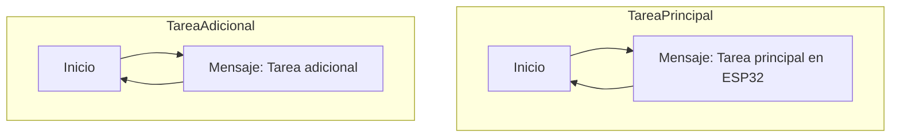

# Practica 4: Sistemas operativos a tiempo real (basico)
## Objetivo: 
- El objetivo de la practica es comprender el funcionamiento de un sistema operativo en tiempo
Real.
- Para lo cual realizaremos una practica donde generaremos varias tareas y veremos como se
ejecutan dividiendo el tiempo de uso de la cpu.
## Materiales: 
- ESP32-S3
## Procedimiento: 
**Codigo:**
```cpp
    #include <Arduino.h>

    void anotherTask( void * parameter );
    void setup()
    {
        Serial.begin(112500);
        /* we create a new task here */
        xTaskCreate(
        anotherTask, /* Task function. */
        "another Task", /* name of task. */
        10000, /* Stack size of task */
        NULL, /* parameter of the task */
        1, /* priority of the task */
        NULL); /* Task handle to keep track of created task */
    }
    /* the forever loop() function is invoked by Arduino ESP32 loopTask */
    void loop()
    {
        Serial.println("this is ESP32 Task");
        delay(1000);
    }
    /* this function will be invoked when additionalTask was created */
    void anotherTask( void * parameter )
    {
        /* loop forever */
        for(;;)
        {
            Serial.println("this is another Task");
            delay(1000);
        }
        /* delete a task when finish,
        this will never happen because this is infinity loop */
        vTaskDelete( NULL );
    }
```
**Descripción:**<br>
Este codigo implementa y ejecuta múltiples tareas en un dispositivo utilizando FreeRTOS, un sistema operativo en tiempo real.<br>
Después de establecer la configuración inicial, se crea una nueva tarea llamada "anotherTask" utilizando la función "xTaskCreate()". Esta tarea consiste en un bucle infinito que imprime un mensaje indicando que se está ejecutando en la tarea adicional. Mientras tanto, la función "loop()" representa la tarea principal del programa y simplemente imprime un mensaje indicando que se está ejecutando antes de esperar un segundo y repetir el proceso. 

**Diagrama de flujos:**


### Salida en el puerto serie: 
```
    this is another Task
    this is ESP32 Task
    this is another Task
    this is ESP32 Task
    this is another Task
    this is ESP32 Task
```

## Conclusión: 
Demuestra cómo crear y ejecutar tareas simultáneamente, lo que permite la multitarea en el dispositivo.
